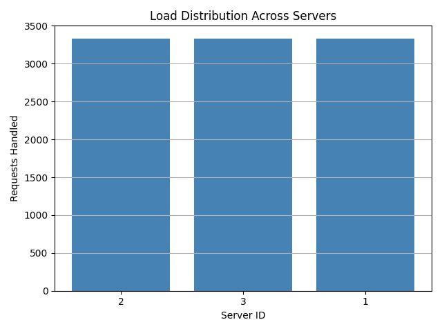
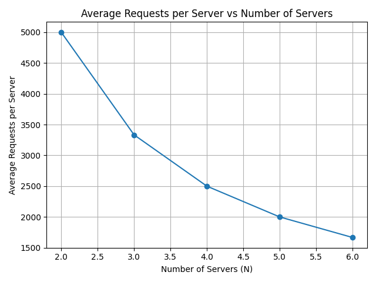

# Custom Load Balancer Using Consistent Hashing

This project is part of a **Distributed Systems** lab focused on implementing a custom load balancer that uses **Consistent Hashing** to distribute client requests across multiple replicated server containers. The system is containerized using Docker and demonstrates concepts such as request routing, scalability, fault tolerance, and replica management.

---

# Project Overview

The project implements a lightweight load balancing system capable of routing incoming HTTP requests to backend server replicas using the **Consistent Hashing** algorithm.

The system consists of:

- A **Load Balancer** that receives and forwards client requests.
- Multiple **Flask server replicas** that process requests.
- Docker containers orchestrated using **Docker Compose**.

The load balancer minimizes request redistribution when replicas are added or removed, making the system scalable and fault tolerant.

---

# Objectives

The project aims to:

- Build a custom load balancer using Consistent Hashing.
- Distribute requests evenly among multiple server replicas.
- Support dynamic replica management.
- Evaluate scalability and load distribution.
- Demonstrate fault tolerance using replicated servers.

---

# System Architecture

```
                    Client
                      │
                      ▼
             +----------------+
             | Load Balancer  |
             | Consistent Hash|
             +----------------+
                │    │    │
                ▼    ▼    ▼
           Server1 Server2 Server3
```

---

# Project Structure

```
Custom-Load-Balancer-main/

│
├── client/
│   ├── test_client.py
│   ├── test_load_distribution.py
│   ├── test_scalability.py
│   ├── test_failure.py
│   ├── requirements.txt
│   ├── load_distribution.png
│   └── scalability_chart.png
│
├── server/
│   ├── server.py
│   └── Dockerfile
│
├── consistent_hash.py
├── load_balancer.py
├── Dockerfile
├── docker-compose.yml
├── requirements.txt
└── README.md
```

---

# Technologies Used

- Python 3.12
- Flask
- Docker
- Docker Compose
- Requests Library
- Consistent Hashing

---

# Installation and Setup

## Clone the Repository

```bash
git clone https://github.com/kisotu2/Custom-Load-Balancer-main.git

cd Custom-Load-Balancer-main
```

## Build the Docker Images

```bash
docker compose build
```

## Start the Containers

```bash
docker compose up -d
```

## Verify Running Containers

```bash
docker ps
```

The application should start four containers:

- load_balancer
- server1
- server2
- server3

### Running Containers


---

# API Endpoints

| Endpoint | Method | Description |
|-----------|----------|-----------------------------|
| `/home?id=<id>` | GET | Routes a request using Consistent Hashing |
| `/rep` | GET | Displays active replicas |
| `/add` | POST | Adds replicas |
| `/rm` | DELETE | Removes replicas |

---

# Backend Server Verification

Each backend server exposes the `/home` endpoint.

```bash
curl http://localhost:5001/home

curl http://localhost:5002/home

curl http://localhost:5003/home
```

Example Response

```json
{
    "message":"Hello from Server server1",
    "status":"successful"
}
```


---

# Active Replicas

The load balancer keeps track of all active server replicas.

```bash
curl http://localhost:6000/rep
```

Example Response

```json
{
    "message":{
        "N":3,
        "replicas":[
            "server1",
            "server2",
            "server3"
        ]
    },
    "status":"successful"
}
```


---

# Request Routing

Incoming requests are routed according to the Consistent Hashing algorithm.

```bash
curl "http://localhost:6000/home?id=1"

curl "http://localhost:6000/home?id=25"

curl "http://localhost:6000/home?id=300"

curl "http://localhost:6000/home?id=999"
```

Expected Result

Different request IDs are forwarded to different backend replicas.

> **Insert Screenshot**

```
screenshots/request-routing.png
```

---

# Replica Management

## Adding a Replica

```bash
curl -X POST http://localhost:6000/add \
-H "Content-Type: application/json" \
-d '{"n":1,"hostnames":["server4"]}'
```

> **Insert Screenshot**

```
screenshots/add-replica.png
```

---

## Removing a Replica

```bash
curl -X DELETE http://localhost:6000/rm \
-H "Content-Type: application/json" \
-d '{"n":1,"hostnames":["server4"]}'
```

> **Insert Screenshot**

```
screenshots/remove-replica.png
```

---

# Consistent Hashing Implementation

The load balancer implements a **Consistent Hash Ring** to determine which server should process each incoming request.

The implementation:

- Maps servers onto a circular hash ring.
- Hashes each client request.
- Routes the request to the nearest server clockwise on the ring.
- Minimizes request redistribution whenever replicas are added or removed.

This approach provides:

- Balanced load distribution
- Scalability
- Efficient routing
- Fault tolerance

---

# Experimental Results

## A-1 Load Distribution

10,000 requests were sent through the load balancer.

The requests were distributed almost equally across the available replicas, confirming that the Consistent Hashing algorithm effectively balances workload.



---

## A-2 Scalability

The scalability experiment evaluated system performance while increasing the number of server replicas.

As more replicas were added, the average workload handled by each server decreased, demonstrating effective horizontal scalability.



---

## A-3 Fault Tolerance

To evaluate fault tolerance, one server container was stopped while requests continued to be sent through the load balancer.

```bash
docker stop server2

curl "http://localhost:6000/home?id=123"

docker start server2
```

The remaining replicas continued serving requests successfully.

> **Insert Screenshot**

```
screenshots/failure-recovery.png
```

---

## A-4 Hash Function Analysis

The original polynomial hash functions were replaced with SHA-256–based hashing.

### Original

```
H(i) = (i² + 2i + 17) % M

Φ(i,j) = (i² + j² + 2j + 25) % M
```

### Updated

SHA-256 hashing was used for both request mapping and virtual server placement.

### Observations

- Improved load distribution.
- More uniform request allocation.
- Better scalability.
- Reduced imbalance after server removal.

---

# Performance Analysis

The experimental results demonstrate that:

- Requests are evenly distributed across replicas.
- Increasing replicas improves scalability.
- Consistent Hashing minimizes request redistribution.
- The system continues operating after replica failures.
- Docker Compose simplifies deployment and management.

---

# Challenges Encountered

During development the following challenges were encountered:

- Docker networking configuration
- Container communication
- Python package imports
- Docker Compose configuration
- Load balancer debugging
- Consistent Hashing implementation

Each issue was resolved through incremental testing and debugging.

---

# Future Improvements

Possible future enhancements include:

- Automatic heartbeat monitoring
- Dynamic replica creation
- Automatic failure recovery
- Health checks
- Metrics dashboard
- Kubernetes deployment
- HTTPS support
- Logging and monitoring

---

# Conclusion

This project successfully demonstrates the implementation of a Docker-based custom load balancer using the Consistent Hashing algorithm.

The system effectively distributes client requests across replicated backend servers while supporting scalability and improved fault tolerance. The experimental results confirm that Consistent Hashing provides balanced request distribution and minimizes request reassignment during scaling operations.

---

# Author

**Samuel Kisotu**

Distributed Systems

Strathmore University

2026
